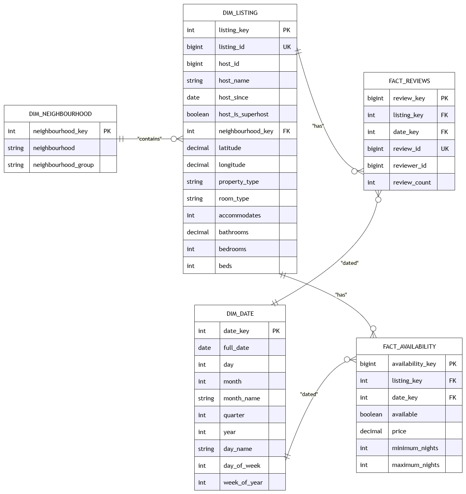

# Data Warehouse Modeling Approach

This document outlines the dimensional modeling process for the Airbnb Barcelona Data Warehouse. The design strictly follows the **Kimball 4-Step Dimensional Modeling** methodology to ensure the data is optimized for OLAP (Online Analytical Processing) queries and business intelligence reporting.

## Kimball's 4-Step Design Process

### 1. What is the Business Process?
The first step is to identify the core operational processes of the business. For Airbnb, the key processes we are modeling are:
* **Property Availability:** Tracking which listings are available on specific dates and their booking constraints.
* **Customer Reviews:** Capturing customer engagement and feedback volume over time.

### 2. What is the Grain?
The grain determines the level of detail in a single row of the Fact table. Since we have two distinct business processes, we have two fact tables with different grains:
* **FactAvailability:** One row per *listing* per *calendar date*.
* **FactReviews:** One row per *individual review* left by a reviewer for a specific listing on a specific date.

### 3. What are the Dimensions?
* **DimListing:** Contains all descriptive attributes of the property . *Note: Base `price` is stored here as it represents a static property attribute in this specific dataset.*
* **DimNeighbourhood:** Provides geographical grouping to analyze trends across different areas of Barcelona.
* **DimDate:** A comprehensive date dimension used to slice and dice the data by day, month, quarter, year, and day of the week.

### 4. What are the Facts?
* **FactAvailability** 
* **FactReviews**

---

## Star Schema Architecture
The resulting architecture is a robust **Star Schema** with shared conformed dimensions (`DimListing`, `DimDate`). This allows cross-process analysis, such as comparing a listing's total reviews in a specific month against its availability in that same month.
