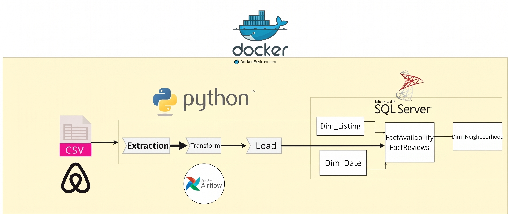

# 🏙️ Airbnb Barcelona - End-to-End Data Warehouse
An end-to-end Data Engineering project that extracts, transforms, and loads (ETL) large-scale Airbnb data into a centralized Data Warehouse using a custom Star Schema. The pipeline is containerized using Docker and orchestrated via Apache Airflow.

## Project Overview
The objective of this project is to build a robust and automated Data Warehouse for Airbnb listings, reviews, and availability in Barcelona. It processes over **6.6 Million rows** of data, enabling business analysts to derive meaningful insights such as pricing trends, neighborhood popularity, and optimal listing recommendations.

## Requirements:
Design Data warehouse schema.
Load data into DW.
Answer Below business qestions:
1. Finding the cheapest most available listing for a specific month (e.g., Jan 2027).
2. Identifying the most expensive neighborhoods in Barcelona.
3. Tailoring budget-friendly recommendations for college students planning a New Year's Eve trip.
4. Discovering the most reviewed properties to analyze customer engagement.

## Resources
- [Airbnb.com](https://www.airbnb.com)

## Tech Stack
- **Language:** Python (Pandas, SQLAlchemy, PyODBC)
- **Database:** Microsoft SQL Server
- **Orchestration:** Apache Airflow
- **Containerization:** Docker & Docker Compose
- **Data Modeling:** Star Schema Design

## Data Architecture (Star Schema)
The data warehouse is built on a Star Schema optimized for OLAP queries:
- **Fact Tables:** 
  - `FactAvailability` (~5.5M rows)
  - `FactReviews` (~1M rows)
- **Dimension Tables:** 
  - `DimListing`
  - `DimNeighbourhood`
  - `DimDate`

## Key Engineering Features
- **Data Quality & Validation:** Implemented strict transformations to handle missing values, correct data types (e.g., currency parsing), and guarantee zero orphan records.
- **Performance Optimization:** Utilized `fast_executemany` chunking in Python to load millions of records into SQL Server in under 20 minutes.
- **Automated Orchestration:** Integrated Apache Airflow to schedule and monitor the pipeline (`run_staging_layer` >> `run_data_warehouse_layer`), moving the project from manual execution to a production-ready state.
- **Custom Docker Image:** Built a customized Airflow Docker image packed with Microsoft ODBC Driver 18 for seamless SQL Server connectivity.

